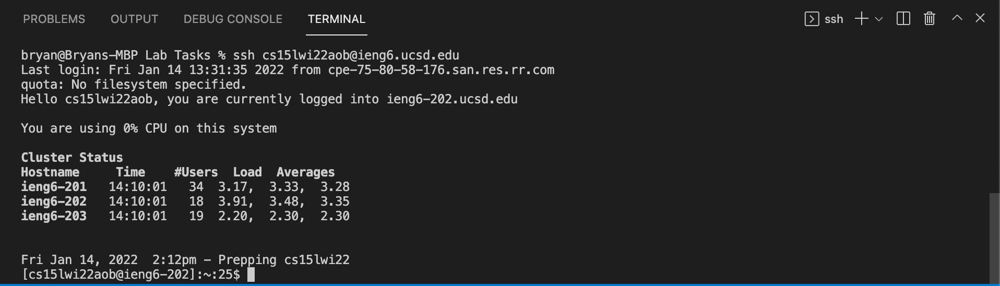

# Remote Access Tutorial

## Step 1: Installing VScode

Navigate to the official VScode website (https://code.visualstudio.com/) and install the VScode editor for Mac by following the instructions. 

## Step 2: Remotely connecting 

Using VScode, connect to a remote computer using VScode's remote option. First, open up a new terminal window by navigating to Terminal and New Terminal from the top menu bar. 

Enter the ssh command to connect to the remote host and it should look like the command seen in the first line of the picture below, but with your course specific account instead. 

Type yes and press enter if you are connecting for the first time, and enter your password. After that, you have successfully connected to the server!

## Step 3: Trying some commands

Now that you are connected to the server, you can try running some commands using the terminal. 

Some common commands you can try include:
1. **ls** - lists all directories in the location 
2. **pwd** - prints the full path name of your current directory (from the root directory)
3. **mkdir** - creates a new directory in the location 
4. **cd** - changes directory to the directory provided

## Step 4: Moving files with scp 
Now, you will attempt to move files between your computer and the remote server by using the scp command. 

Create a new java file. Then in the directory that contains the file, run the command seen in the picture below with your account name using the terminal. 

Enter your password when prompted, and the file will be copied to the remote computer. After you log into ieng6 with ssh, use the ls command and the same file should appear in the home directory. 

## Step 5: Setting an SSH key

To simplify the process of accessing the remote server without having to enter your password every single time, we can implement ssh keys. Enter the command ssh-keygen and enter the appropriate prompts. 

Next, create a .ssh directory on your user account on the remote server and copy the public key to said directory using the scp command from above. 

Now, you should be able to scp and ssh without having to enter your password. 

## Step 6: Optimizing remote running

We can streamline the process of remote running even further by using some tips and tricks.

For example, you can use quotes to directly run commands on the remote server after connecting. On the other hand, semicolons can run multiple commands on the same line in most terminals. As seen in the picture below, the commands are condensed into less lines of code, optimizing the process of remote running

