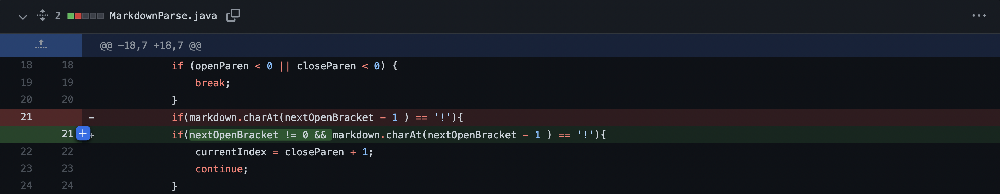
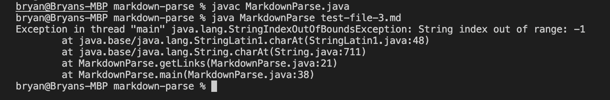
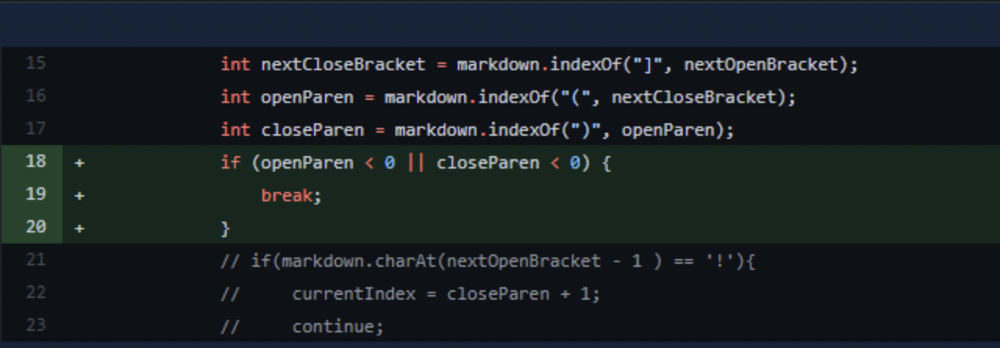
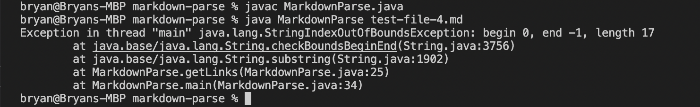
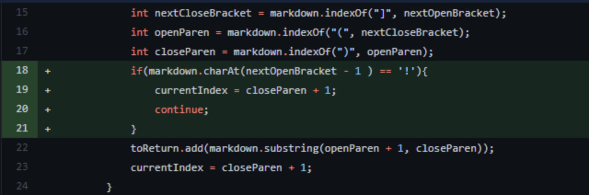
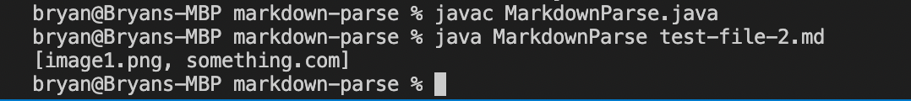

# 3 code changes and fixes for bugs

## Code change 1

[Link to test file for failure inducing input](https://github.com/bryan901/markdown-parse/blob/main/test-file-3.md)

Symptom of failure inducing input (output of running the file):

Relationship between bug, symptom and failure inducing input: 

Compiling the file with test-file-3.md causes an index out of bounds exception. The markdown file starts with an open square bracket. This means that the index will be negative because the open square bracket is at index 0.In order to dix this bug, we must include a condition that ensures the index is non-negative. 

## Code change 2  

[Link to test file for failure inducing input](https://github.com/bryan901/markdown-parse/blob/main/test-file-4.md)

Symptom of failure inducing input (output of running the file):

Relationship between bug, symptom and failure inducing input: 

Compiling and running the file with test-file-4.md throws an index out of bounds exception too. This happens because there are no parentheses in the code. As a result, the value of openParen and closeParen were both negative. This causes calling the substring function to throw an exception. In order to fix this bug, we added a codition to break out of the loop if there are no parentheses to ensure that an exception is not thrown. 

## Code change 3  

[Link to test file for failure inducing input](https://github.com/bryan901/markdown-parse/blob/main/test-file-2.md)

Symptom of failure inducing input (output of running the file):

Relationship between bug, symptom and failure inducing input: 

Compiling and running the file with test-file-2.md produces the wrong output ax the image is mistaken for a link and it gets printed out. This happens because image and link formats in markdown is similar, and the only difference is the exclamation mark '!' in front of the image. Thus, in order to fix this bug, we include a condition that checks for the exclamation mark to exclude images from being identified and printed out. 