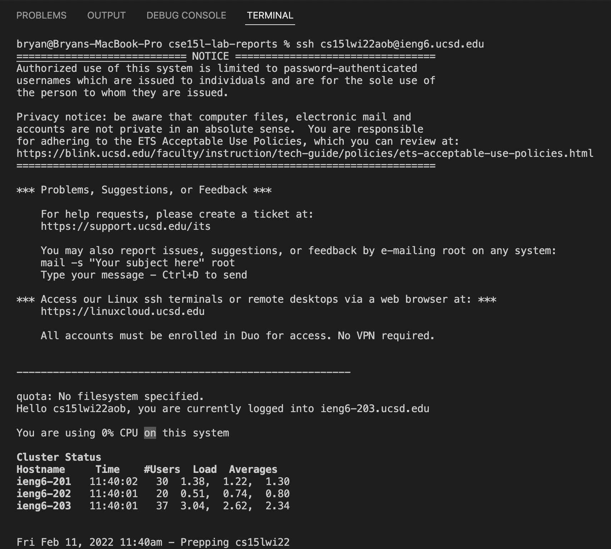
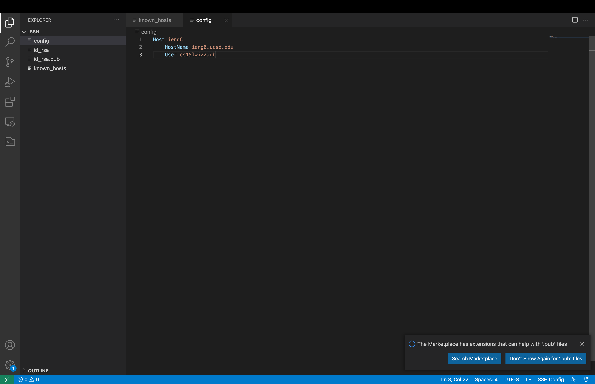
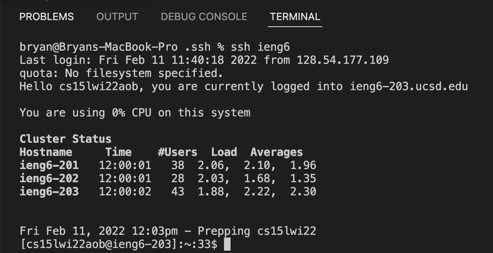
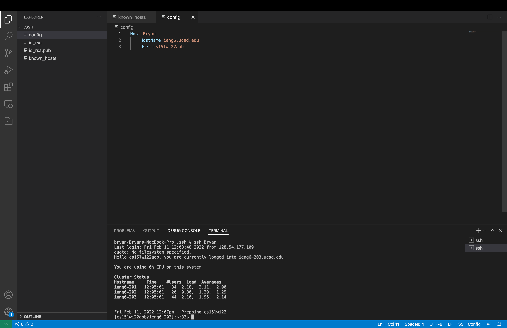
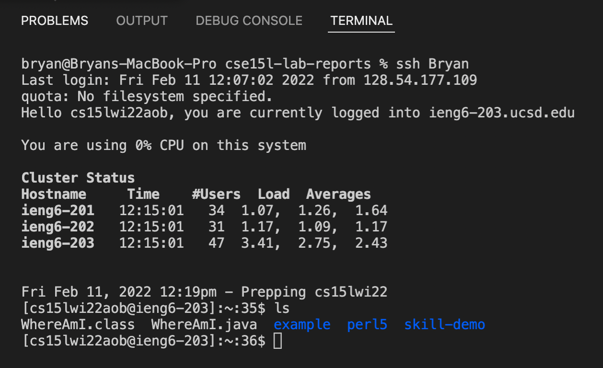

# Streamlining `ssh` configuration

## Current login process

Currently, to access ieng6, users have to remember their usernames and enter it in the command prompt in oder to login to their account. This process is complicated as the usernames are long and complicated. 

## Configuration

Locate and open the .ssh folder, on a mac I used Command-Shift-G in the Finder and entered `~/.ssh` to find it. Then, change the configurations of the file or create a new file if one does not exist. 

Now, if we use the `ssh ieng6` command in the terminal, the login process will be much faster as we no longer have to enter our usernames.

## Aliases

You can also change the alias by changing the name of the Host under the config file. In this example, I changed the Host name to Bryan. The next time I log in, I simply have to enter the command `ssh Bryan` and my computer will automatically connect to ieng6 using my username and account. 

On top of that, we can also use commands like `scp` with the new alias to make the process more streamlined.

After running the `scp` command with the alias, and logging back into ieng6, we can see that the file has been successfully copied over and everything works.

