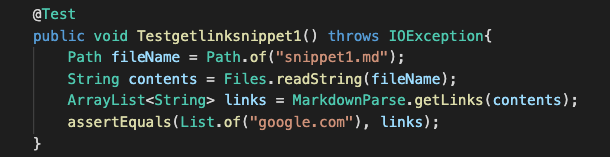
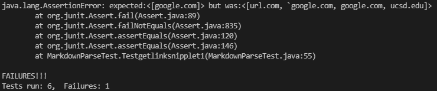
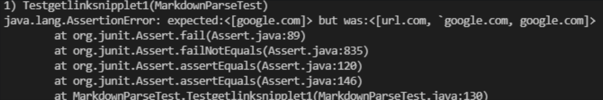
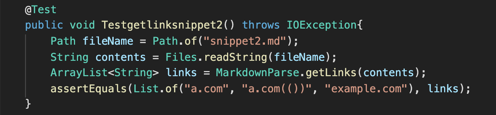
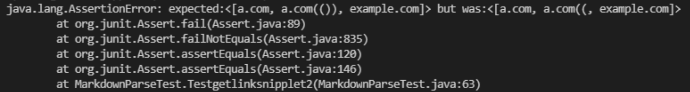
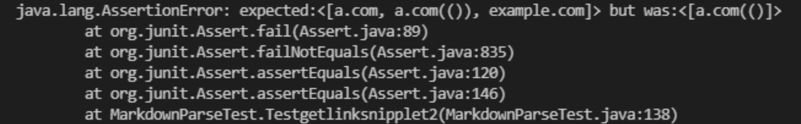
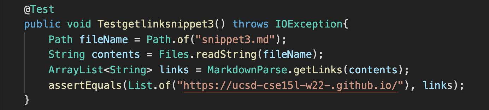
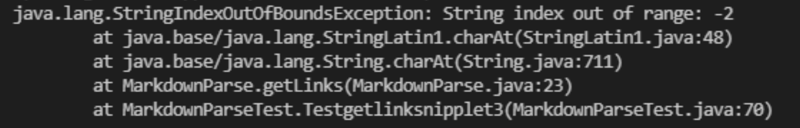
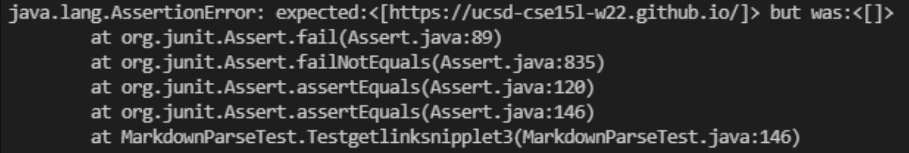

# Testing 3 Snippets

## Snippet 1

### JUnit Test

### Output from my implementation

### Output from shared code implementation

## Snippet 2

### JUnit Test

### Output from my implementation

### Output from shared code implementation

## Snippet 2

### JUnit Test

### Output from my implementation

### Output from shared code implementation

## Questions

1. Yes, I think that a small code change less than 10 lines can make the program work for snippet 1. This can be done through including a check before the index is taken.We can check to make sure that there aren't backticks within "[]". This will make sure that the code will exclude the invalid links.

2.  Yes, I think that a small code change less than 10 lines can make the program work for snippet 2. This can be done through including a check on the parentheses. We can check and take the parenthesis before the next bracket as the close index. We can also take the last closing bracket before the parenthesis, and this will make sure that the code runs properly.

3. No, I don't think that a small code change less than 10 lines can make the program work for snippet 3. This is mainly because the implementation of the getLink method functions through indexing parenthesis and brackets. To fix the issue for snippet 3, more than 10 lines of code change will be required as checking for empty lines is harder and line change within the parenthesis is harder to index.

Link to my markdown-parse repository: [markdown parse 1](https://github.com/bryan901/markdown-parse)

Link to reviewed markdown-parse repository: [markdown parse 2](https://github.com/aldrincheung/markdown-parse
)